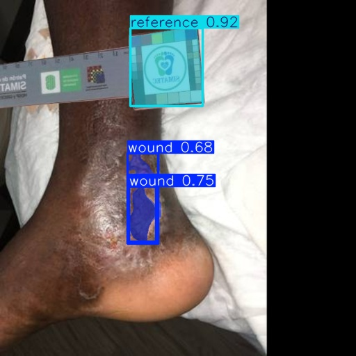
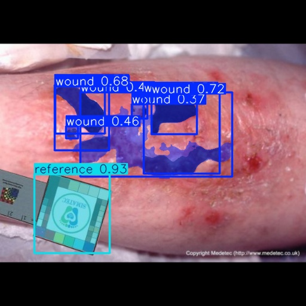
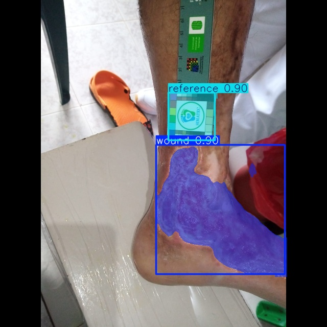
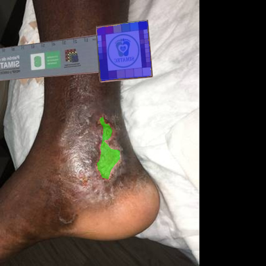
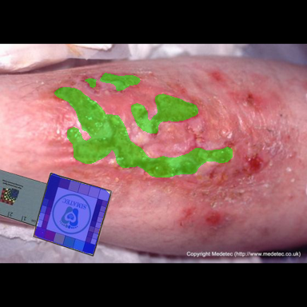
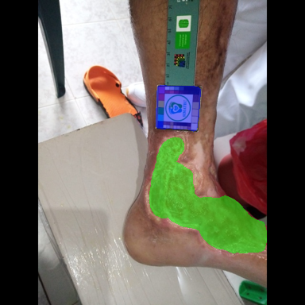
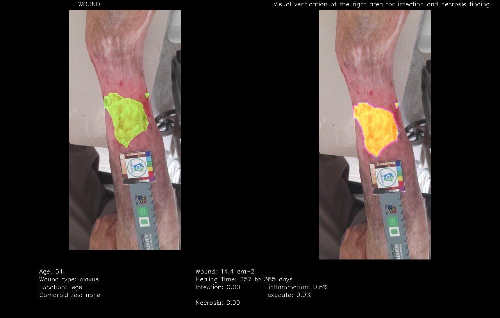
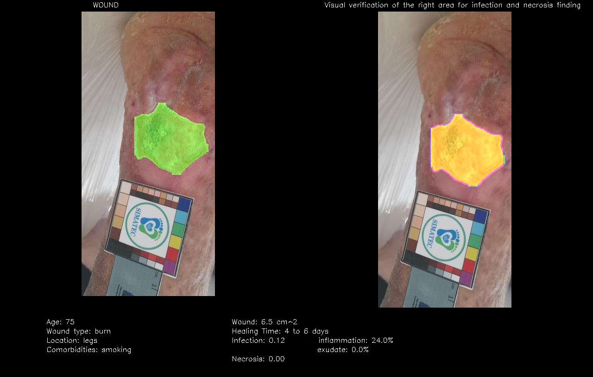
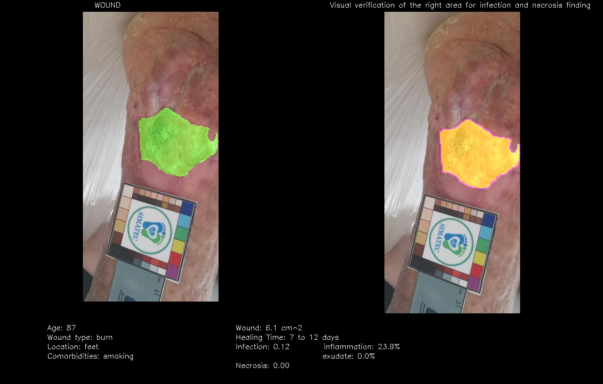
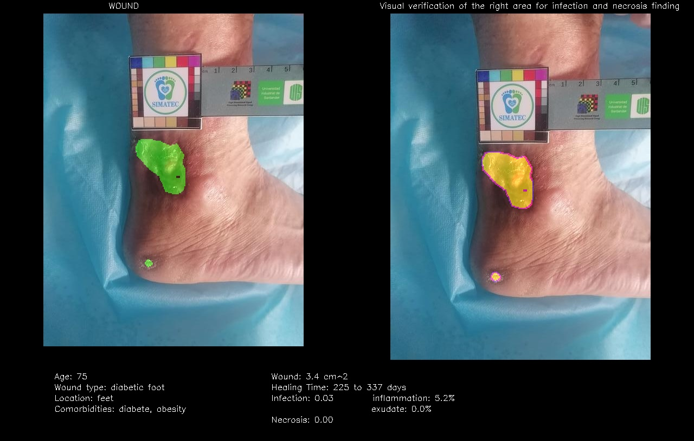

This project is the continuation of https://github.com/void-1409/wound_segmentation

Overview

This project contains YOLOv11-seg and deeplabv3_resnet segmentation model which is designed to segment wounds and a reference image from input images. The reference image have a known surface area which is then used to calculate the actual area of segmented wound from the image.

Features

    Wound Detection and Segmentation: Accurately detects and then segments wound in images.

    Reference Segmentation: Accurately detects and then segments reference image to assist in wound area calculations.

    Huge Dataset: Trained on manually labeled custom dataset and a kaggle dataset (https://www.kaggle.com/datasets/leoscode/wound-segmentation-images), , extended and relabeled.

    Easy Retraining: Easy to retrain on similar dataset for even more precise calculations.

    Wound healing time prediction: By giving parameter to the model you can predict the healing time (and modifying the parameter easily)

    Detection of infection and necrosis: Using dilatation of the wound area and precise spectrum of color we can get a probability of presence of necrosis and infection.

Run the live segmentation using your webcam

    yolo segment predict model=wound_management_yolov11n-seg.pt source=0 show=True save=False conf=0.75

    Note: source=0 here means it takes your camera as input and shows live video feed. show=True displays the live detection, and turning this to False will not display any video feed
    save=False is used to not save the whole live video. If you want the full video to be saved to your system, then change this to True. Change the Yolo model for your're need, n is faster, x is better.
    
Run the healing time prediction

    Look at the parameters tables (you can extend it if needed), verify input_folder, path_model and output_folder are corect for what you want. Run the code.

    The result will be in the folder healing, for the most efficient result use wound_size_bis_deeplabv3.pth or wound_management_yolov11x-seg.pt

Dataset

    The dataset used for training this model consists of labeled images and masks, with two classes.

    Wound Class: labelled as wound, green in masks, 0 in labels.

    Reference Class: labelled as reference, blue in masks, 1 in labels.

Retraining the Model

    In order to retrain the model, you can use pre-trained weights

    The first training was done only on wound class and there was no reference class. With 3017 train, 752 val et 433 test images.
    The second training was done on top of the first training with both wound and reference classes in training set. with 1000 train, 200 val et 100 test images.

example of output image (yolo)

example of output image (resnet)

example of healing image (yolo)

example of healing image (resnet)

exeplication of the file :

    data is only about wound (basic training for yolo) 
    data_buff is only about wound
    data_with_ref is for the wound + reference 

    output is for the inference of the models
    healing is contain the image processing result

    data.yaml is for basic wound training of yolo
    data1.yaml is for wound training of yolo
    data2.yaml is for wound + reference training of yolo

    data_pytorch is for wound training of resnet
    data_pytorch_1 is for wound + reference training of resnet

    wound_management.ipynb is the code for the project

    basic model (yolo)
        basic_wound_model_yolov11n-seg.pt           (wound)
        basic_wound_management_yolov11n-seg.pt      (wound + reference)
        basic_wound_model_yolov11x-seg.pt           (wound)
        basic_wound_management_yolov11x-seg.pt      (wound + reference)

    model (yolo)
        wound_model_yolov11n-seg.pt                 (wound)
        wound_management_yolov11n-seg.pt            (wound + reference)
        wound_model_yolov11x-seg.pt                 (wound)
        wound_management_yolov11x-seg.pt            (wound + reference)

    model (resnet)
        wound_management_deeplabv3.pth              (wound)
        wound_size_deeplabv3.pth                    (wound + reference)
        wound_size_bis_deeplabv3.pth                (wound + reference + other)